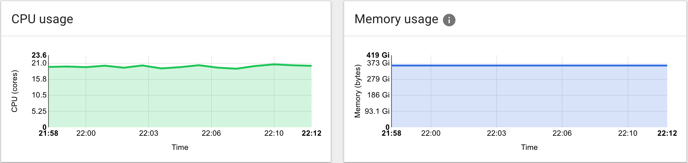

All Hands: Backend team
-----------------------

April 2018<!-- .element: style="padding-top:200px;" -->

What the backend team has been up to?
-------------------------------------

(just me)

* survey the landscape
* put out fires
* make a plan for going forward

## State of the backend

* it does quite a lot!
* latency is generally low.
* we're using some cool tech, like Kubernetes.
* our metrics system is good.
* we have continuous deployment.

Note:
The backend has quite a lot of features and subsystems, including an admin section.
Latency being low means requests are answered quickly.
Continuous deployment means it's easy to get fresh code (and bug fixes) into production quickly.

<i>however,</i>

* it's written in two different programming languages.
  * running together, on a platform for a third.

* the whole stack is like a house of cards, making it difficult to upgrade anything.

* we're using very large amounts of memory.

<!-- .element: style="border: 0;box-shadow: none;" -->

* we're using complex components in both of our languages.

* our logging system is almost non-existent.

* behavior specs are scarce.

Long term plans
---------------

* make it work without babysitting.
* make it scale (10x, with a path towards 100x).
* make it modular.

Breaking up the system into smaller pieces:

* makes it more introspectable.
* makes the pieces more independent and replaceable.
* makes the pieces simpler and lighter on resources.
* enables work in parallel.

Note:
Break up the system into specialized chunks.
Parallel as in several developers working independently.
For example: admin interface sharing a deployment with game APIs.

This also makes the backend more complex.
* we're already running Kubernetes.
* we need a unified structured logging system.

* switch to declarative interfaces and data structures.
* written behavior specs - start writing docs!
* introduce a degree of maturity into the system.

Note:
Start using FlatBuffers at a certain point.
For example, take the chat system. It has this interface, and when this happens,
this other thing needs to happen.

Short term plans
----------------

* implement a new component - a router - to facilitate modularization.
* replace the room subsystem, because it's the most complex.
* load test the system while developing it using bots.
* do the switch piecemeal, in place.
* keep replacing subsystems.

Note:
Doing the switch in-place means a smaller shock to the system, and
changes can be rolled back.

Tin's personal reflections
--------------------------

* the broad strokes are very simple, but the devil's in the details.
* there are a lot of small features, some of which have been basically abandoned.
* no design docs.
* remote work - time differential OK, isolation could be a problem.
* no one to bounce ideas off of.
