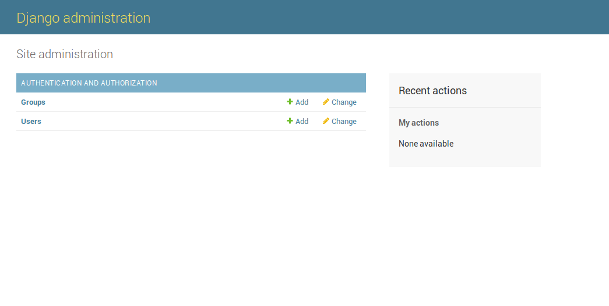
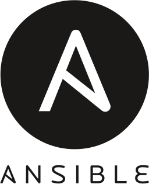
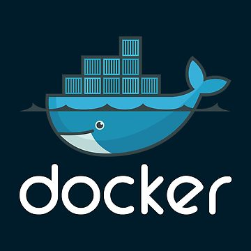
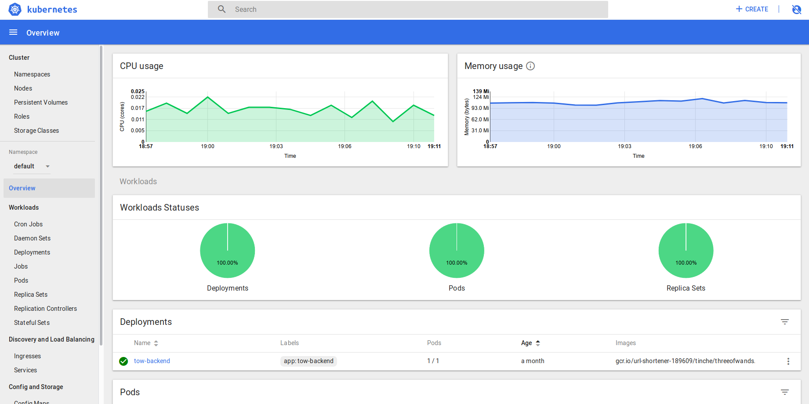

Deploying 🐍 in the ☁
----------

@tintvrtkovic<!-- .element: style="padding-top:200px;" -->

February 2018

<!-- .slide: data-background="#FFFFFF" -->
<!-- .element: style="border: 0;box-shadow: none;" -->

Note:

I used to work for Nanobit.

<!-- .slide: data-background="#FFFFFF" -->
Highrise

<!-- .element: style="border: 0;box-shadow: none;" -->

Note:

Now I work for a company called PocketzWorld, on Highrise.

<!-- .slide: data-background="#FFFFFF" -->
<!-- .element: style="border: 0;box-shadow: none;" -->

Note:
Let's say you want to make a web site, and you choose Python. You're probably
using Django.

<pre><code style="padding-left:50px" class="lang-bash">
$ python3 -m venv .venv
$ . .venv/bin/activate
(.venv) $ pip install django
(.venv) $ django-admin startproject cloud

</code></pre>

<pre><code style="padding-left:50px" class="lang-bash">
.
├── cloud
│   ├── __init__.py
│   ├── settings.py
│   ├── urls.py
│   └── wsgi.py
├── db.sqlite3
├── manage.py
└── requirements.txt

</code></pre>

Note:
So you generate a Django project, and start working on it. You're using a
SQLite database and manage.py runserver.

<!-- .element: style="border: 0;box-shadow: none;" -->

Note:
Instead of actually making an app, let's just use the admin app.
That'll work because:
* it needs the database
* it needs an initial migration, and the creation of the first superuser
* it needs static files

<!-- .element: style="border: 0;box-shadow: none;" -->

* ssh
* transfer the code
* recreate the dev environment
* edit the settings

Note:
* doesn't serve static files in prod
  * install and configure nginx, or use whitenoise
* some settings are different:
  * debug flag
  * allowed hosts
  * secret key
  * DB url

<!-- .element: style="border: 0;box-shadow: none;" -->

Note:
Maybe you'll get bored and use Ansible. I hope you'll get bored and use Ansible.
Ansible problems:
* how do you get your code to your server
* how do you deal with maintaining the virtualenv
* how do you install and configure everything you need? nginx? unattended-upgrades

## Let's Do This The Modern Way

https://github.com/Tinche/cloud-python-tutorial

<!-- .slide: data-background="#001C2A" -->
<!-- .element: style="border: 0;box-shadow: none;" -->
Note:
Let's talk about Docker.

### Docker is:

* a daemon process that builds and runs Docker images

* a file format and an image format

* a company

Note:
The Docker daemon runs on Windows, macOS and Linux.
Docker images are like virtualenvs, except they work for all languages.
They contain all the dependencies, including the OS.

### A Simple Docker Workflow

#### Your laptop:
Dockerfile ➔ Docker image ➔ Docker registry

#### Your server:
Docker registry ➔ Docker container

<pre><code>
    FROM python:3.6-slim

    WORKDIR /app
    RUN python -m venv .venv
    COPY requirements.txt requirements.txt
    RUN .venv/bin/pip install -r requirements.txt
    COPY cloud cloud
    COPY static static
    COPY manage.py manage.py

    ENTRYPOINT [ ".venv/bin/python", "manage.py" ]

</code></pre>

<pre><code>
    $ docker build -t tinche/cloud-python .

</code></pre>

<pre><code>
    $ docker images
    REPOSITORY            TAG      IMAGE ID       CREATED      SIZE
    tinche/cloud-python   latest   ad8148554aa5   4 days ago   178MB

</code></pre>

Note:
Now that we've built the image, we can run it locally. But the storage inside
running containers is transient by default (unless you mount something in),
so let's just use a dev Postgres.

### settings_prod.py

<pre><code>
    from .settings import *  # noqa

    DEBUG = False
    ALLOWED_HOSTS = ["*"]

    DATABASES = {
      'default': {
          'ENGINE': 'django.db.backends.postgresql',
          'HOST': os.environ['DB_HOST'],
          'PORT': os.environ['DB_PORT'],
          'USER': os.environ['DB_USER'],
          'PASSWORD': os.environ['DB_PASSWORD'],
          'NAME': 'cloud_python',
      }
    }

</code></pre>

Note:
In order to actually do this, we'll refactor a little to get the DB
info from the environment.

<pre><code>
    $ docker run -d -p 5432:5432 postgres

</code></pre>

Note:
We're using Docker already, why don't we just use it to run our dev DB?

<pre><code>
  $ docker run --rm -ti tinche/cloud-python

  Type 'manage.py help &ltsubcommand&gt' for help on a specific subcommand.

  Available subcommands:

  [auth]
      changepassword
      createsuperuser

  [django]
      check
      compilemessages
      ...

</code></pre>

Note:
Aha, this is basically 'python manage.py', but inside the container.

<pre><code>
    $ docker run --rm -ti \
          -e DJANGO_SETTINGS_MODULE=cloud.settings_prod \
          -e DB_HOST=localhost \
          -e DB_PORT=5432 \
          -e DB_USER=postgres \
          -e DB_PASSWORD=postgres \
          --net host \
          tinche/cloud-python migrate

</code></pre>

Note:
Great, we can migrate like this.

<pre><code>
    $ docker run --rm -ti \
          -e DJANGO_SETTINGS_MODULE=cloud.settings_prod \
          -e DB_HOST=localhost \
          -e DB_PORT=5432 \
          -e DB_USER=postgres \
          -e DB_PASSWORD=postgres \
          --net host \
          tinche/cloud-python runserver

</code></pre>

Note:
We can also run the debug server.

<pre><code>
    $ docker run -d --restart always \
          -e DJANGO_SETTINGS_MODULE=cloud.settings_prod \
          -e DB_HOST=localhost \
          -e DB_PORT=5432 \
          -e DB_USER=postgres \
          -e DB_PASSWORD=postgres \
          --net host \
          --entrypoint .venv/bin/gunicorn
          tinche/cloud-python cloud.wsgi:application

</code></pre>

Note:
We can also run production Gunicorn with this image.
Now our workflow could be:
* On laptop: build image, push to registry
* On server: pull image, stop old container, start new container
If we could only script this.
This is where bare Docker isn't enough any more.

<!-- .slide: data-background="#326DE6" -->
<!-- .element: style="border: 0;box-shadow: none;" -->

Note:
Let's talk about Kubernetes.

### Kubernetes is:

* a huge open source project

* sometimes abbreviated as k8s

* a set of applications that, together, make a Kubernetes cluster

* a way to convert VMs into CPU cores and RAM

Note:
The main K8s repository has 32000 stars, over 1500 contributors, over 60k commits.
There are alternatives, but IMO Kubernetes has won.

### Running Kubernetes:

* minikube, on your computer

* in the cloud yourself, using kops

* in the cloud, managed, using GKE, ACS or ECS for Kubernetes

Note:
Just use a managed version. For this tutorial we're using GKE.

### Interacting with Kubernetes

* dashboards

* kubectl with yaml files

Note:
Google has their own Kubernetes dashboard. There is a generic one.
kubectl is a command line utility.

<!-- .slide: data-background="#326DE6" -->
<!-- .element: style="border: 0;box-shadow: none;" -->

<pre><code>
    $ kubectl get deployments
    NAME          DESIRED   CURRENT   UP-TO-DATE   AVAILABLE   AGE
    tow-backend   1         1         1            1           33d

</code></pre>

### Kubernetes primitives:

 - deployments, replicasets, pods, containers
 - services
 - ingresses
 - configmaps, secrets
 - namespaces, cron jobs, stateful sets, daemon sets
 - persistent volumes, persistent volume claims, limit ranges
 - roles, clusterroles, clusterrolebindings
 - events, autoscalers

Note:
Kubernetes introduces a lot of stuff.

### Steps:

* create a Google Cloud project
* create a Kubernetes cluster
* provision a Postgres database
* push the image

Note:
Why provision a managed Postgres? Kubernetes has support for stateful
workloads, but just let your cloud provider take care of it.

<pre><code>
    $ docker tag tinche/cloud-python gcr.io/p_id/tinche/cloud-python
    $ gcloud docker -- push gcr.io/p_id/tinche/cloud-python

</code></pre>

Note:
Your Kubernetes cluster comes with its own registry.

### Preparations

* whitelist your IP for DB access

* run:

<pre><code>
    $ docker run --rm -ti \
          -e DJANGO_SETTINGS_MODULE=cloud.settings_prod \
          -e DB_HOST=&lt;ip&gt; \
          -e DB_PORT=5432 \
          -e DB_USER=&lt;user&gt; \
          -e DB_PASSWORD=&lt;password&gt; \
          tinche/cloud-python migrate

</code></pre>

### Deployments

Note:
Deployments are used when you want to actually run your Docker images.

<pre><code>
    apiVersion: apps/v1beta2
    kind: Deployment
    metadata:
      name: cloud-python
      labels:
        app: cloud-python
    spec:
      replicas: 2
      spec:
        containers:
          - name: cloud-python
            image: gcr.io/p_id/tinche/cloud-python
            ports:
            - containerPort: 8000
            command: [".venv/bin/gunicorn", ...]

</code></pre>

Note:
This is a YAML file describing a deployment.

<pre><code style="max-height:600px;">
        containers:
          - name: cloud-python
            ...
            env:
              - name: DB_HOST
                value: "127.0.0.1"
              - name: DB_PORT
                value: "5432"
              - name: DB_USER
                valueFrom:
                  secretKeyRef:
                    name: cloud-python-db-credentials
                    key: username
              - name: DB_PASSWORD
                valueFrom:
                  secretKeyRef:
                  name: cloud-python-db-credentials
                  key: password
              - name: DJANGO_SETTINGS_MODULE
                value: cloud.settings_prod

</code></pre>

<pre><code style="max-height:600px;">
        containers:
          - name: cloud-python
            ...
            readinessProbe:
              httpGet:
                path: /admin/login/
                port: 8000
            resources:
              requests:
                cpu: "50m"

</code></pre>

<pre><code style="max-height:600px;">
  containers:
    - name: cloudsql-proxy
      image: gcr.io/cloudsql-docker/gce-proxy:1.11
      command: ["/cloud_sql_proxy",
                "-instances=url-shortener-189609:us-central1:cloud-python=tcp:5432",
                "-credential_file=/secrets/cloudsql/credentials.json"]
      volumeMounts:
        - name: cloudsql-instance-credentials
          mountPath: /secrets/cloudsql
          readOnly: true
      volumes:
        - name: cloudsql-instance-credentials
          secret:
            secretName: cloudsql-instance-credentials
        - name: cloudsql
          emptyDir:

</code></pre>

Note:
This is how you connect to CloudSQL on GKE. *shrug*

<pre><code>
    $ kubectl apply -f deployment.yaml

    $ kubectl get deployments
    NAME           DESIRED   CURRENT   UP-TO-DATE   AVAILABLE   AGE
    cloud-python   2         2         2            2           46s

    $ kubectl get pods
    NAME                            READY     STATUS    RESTARTS   AGE
    cloud-python-7f48785cb6-crbcr   2/2       Running   0          1m
    cloud-python-7f48785cb6-kvpjc   2/2       Running   0          1m

</code></pre>

<pre><code>
    kind: Service
    apiVersion: v1
    metadata:
      name: cloud-python
    spec:
      type: NodePort
      selector:
        app: cloud-python
      ports:
      - protocol: TCP
        port: 8000

</code></pre>

Note:
The service makes the pods actually reachable. It can work several ways,
but the default is just ip tables.

<pre><code>
    $ kubectl apply -f service.yaml

</code></pre>

<pre><code>
    apiVersion: extensions/v1beta1
    kind: Ingress
    metadata:
      name: cloud-python
    spec:
      backend:
        serviceName: cloud-python
        servicePort: 8000

</code></pre>

<pre><code>
    $ kubectl apply -f ingress.yaml

    $ kubectl describe ingress cloud-python

</code></pre>

Note:
You'll get the IP here. Just click it and that's it!

### Improvement #1

<pre><code style="max-height:600px;">
    FROM python:3.6-slim as builder

    WORKDIR /app
    RUN python -m venv .venv
    COPY requirements.txt requirements.txt
    RUN .venv/bin/pip install -r requirements.txt
    COPY cloud cloud
    COPY static static
    COPY manage.py manage.py

    FROM python:3.6-slim
    WORKDIR /app
    COPY --from=builder /app/.venv /app/.venv
    COPY --from=builder /app/cloud /app/cloud
    COPY --from=builder /app/manage.py /app/manage.py
    COPY --from=builder /app/static /app/static

    ENTRYPOINT [ ".venv/bin/python", "manage.py" ]

</code></pre>

Note:
We now use a builder container and a deployment container. This is especially
useful when using C-things.

### Improvement #2

<pre><code style="max-height:600px;">
    FROM python:3.6-slim as builder

    WORKDIR /app
    RUN python -m venv .venv
    COPY requirements.txt requirements.txt
    RUN .venv/bin/pip install -r requirements.txt
    COPY cloud cloud
    COPY manage.py manage.py
    RUN .venv/bin/python manage.py collectstatic

    FROM nginx:latest
    COPY --from=builder /app/static /usr/share/nginx/html/static

</code></pre>

Note:
We build an extra image just for static files. We use nginx to serve.

<pre><code style="max-height:600px;">
    kind: Deployment
    metadata:
      name: cloud-python-static
    spec:
      replicas: 2
      template:
        metadata:
          labels:
            app: cloud-python-static
        spec:
          containers:
          - name: cloud-python-static
            image: gcr.io/p_id/tinche/cloud-python-static
            ports:
            - containerPort: 80
            readinessProbe:
              httpGet:
                path: /
                port: 80
            resources:
              requests:
                cpu: "10m"⏎

</code></pre>

<pre><code style="max-height:600px;">
    kind: Service
    apiVersion: v1
    metadata:
      name: cloud-python-static
    spec:
      type: NodePort
      selector:
        app: cloud-python-static
      ports:
      - protocol: TCP
        port: 80

</code></pre>

<pre><code style="max-height:600px;">
    apiVersion: extensions/v1beta1
    kind: Ingress
    metadata:
      name: cloud-python
    spec:
      backend:
        serviceName: cloud-python
        servicePort: 8000
      rules:
      - http:
          paths:
          - path: /static
            backend:
              serviceName: cloud-python-static
              servicePort: 80
          - path: /static/*
            backend:
              serviceName: cloud-python-static
              servicePort: 80

</code></pre>

### Improvement #3

<pre><code style="max-height:600px;">
    --- a/requirements.txt
    +++ b/requirements.txt
    @@ -1,5 +1,5 @@
    +bjoern==2.0.4
     Django==2.0.1
    -gunicorn==19.7.1
     psycopg2==2.7.3.2
     pytz==2017.3
     whitenoise==3.3.1

</code></pre>

<pre><code style="max-height:600px;">
    --- /dev/null
    +++ b/cloud/management/commands/runbjoern.py
    @@ -0,0 +1,4 @@
    +import bjoern
    +from cloud.wsgi import application
    +
    +bjoern.run(application, '0.0.0.0', 8000)

</code></pre>

<pre><code style="max-height:600px;">
    FROM python:3.6-stretch as builder

    WORKDIR /app
    RUN python -m venv .venv
    COPY requirements.txt requirements.txt
    RUN apt-get update && apt-get install -y libev-dev
    RUN .venv/bin/pip install -r requirements.txt
    COPY cloud cloud
    COPY manage.py manage.py

    FROM python:3.6-slim-stretch
    WORKDIR /app
    RUN apt-get update && apt-get install -y libev4 && rm -rf /var/lib/apt/lists/*
    COPY --from=builder /app/.venv /app/.venv
    COPY --from=builder /app/cloud /app/cloud
    COPY --from=builder /app/manage.py /app/manage.py

    ENTRYPOINT [ ".venv/bin/python", "manage.py" ]

</code></pre>

<pre><code style="max-height:600px;">
    --- a/deployment.yaml
    +++ b/deployment.yaml
    @@ -19,7 +19,7 @@ spec:
         image: gcr.io/url-shortener-189609/tinche/cloud-python
         ports:
         - containerPort: 8000
    -        command: [".venv/bin/gunicorn", "cloud.wsgi:application", "-b", "0.0.0.0"]
    +        args: ["runbjoern"]
         env:
           - name: DB_HOST
             value: "127.0.0.1"

</code></pre>

# Q&A
