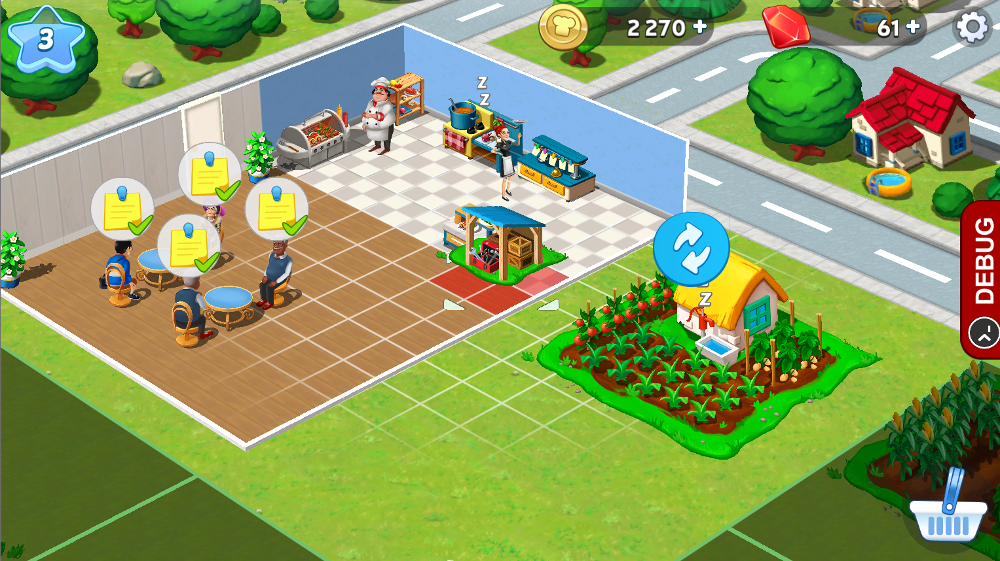

Hypothesis
----------

@tintvrtkovic<!-- .element: style="padding-top:200px;" -->

October 2016

* attrs
* cattrs

<!-- .slide: data-background="#FFFFFF" -->
<!-- .element: style="border: 0;box-shadow: none;" -->

<pre><code>
    $ pip install pytest hypothesis
    
</code></pre>

<pre><code>
    def add(x: int, y: int) -> int:
        ...
    
</code></pre>

<pre><code>
    def test_add():
        assert add(1, 2) == 3
    
</code></pre>

<pre><code>
    @given(integers(), integers())
    def test_add(x, y):
        assert add(x, y) == ???
    
</code></pre>

<pre><code>
    @given(integers(), integers())
    def test_add(x, y):
        assert add(x, y) == add(y, x)  # Commutativity.
        assert add(x, 0) == x          # Additive identity.
    
</code></pre>

<pre><code>
    @given(integers(), integers())
    def test_add(x, y):
        assert add(x, y) == add(y, x)  # Commutativity.
        assert add(x, 0) == x          # Additive identity.

    @given(integers(), integers(), integers())
    def test_add_more(x, y, z):
        assert z * add(x, y) == add(z * x, z * y)     # Distributivity.
        assert add(x, add(y, z)) == add(add(x, y), z) # Associativity.
    
</code></pre>

### Example-based testing:
<pre><code>
    def test_add():
        assert add(1, 2) == 3
    
</code></pre>

### Property-based testing:<!-- .element: style="padding-top:70px;" -->
<pre><code>
    @given(integers(), integers())
    def test_add(x, y):
        assert add(x, y) == add(y, x)
        assert add(x, 0) == x
    
</code></pre>

<!-- .slide: style="padding-top:0;" -->
<!-- .element: style="margin-top:0;" -->

### `from hypothesis import ...`

### Stateless tests
<pre><code>
    from hypothesis import given
    from hypothesis.strategies import integers

    @given(integers(), integers())
    def test_add(x, y):
        assert add(x, y) == add(y, x)
        assert add(x, 0) == x
    
</code></pre>

### Stateless tests
<pre><code>
    from hypothesis import given
    from hypothesis.strategies import integers

    @given(integers(), integers())
    def test_add(x, y, fixture):
        assert add(x, y) == add(y, x)
        assert add(x, 0) == x
    
</code></pre>

<pre><code>
    $ pytest tests.py --hypothesis-show-statistics

    tests.py::test_add:

      - 200 passing examples, 0 failing examples, 0 invalid examples
      - Typical runtimes: < 1ms
      - Stopped because settings.max_examples=200

    
</code></pre>

<pre><code>
    from hypothesis import given, settings
    from hypothesis.strategies import integers

    @given(integers(), integers())
    @settings(max_examples=10000000, timeout=10)
    def test_add(x, y):
        assert add(x, y) == add(y, x)
        assert add(x, 0) == x
    
</code></pre>

<pre><code>
    $ pytest tests.py --hypothesis-show-statistics

    tests.py::test_add:

      - 35137 passing examples, 0 failing examples, 0 invalid examples
      - Typical runtimes: < 1ms
      - Stopped because settings.timeout=10

    
</code></pre>

<pre><code>
    $ export HYPOTHESIS_VERBOSITY_LEVEL=debug
    $ pytest tests.py -s

    Trying example: test_add(x=-36893488147688063149, y=-39199331156901757101)
    Trying example: test_add(x=146, y=24970)
    Trying example: test_add(x=-6129, y=14183)
    Trying example: test_add(x=-93101281200085855105951158222746680257, y=-218968679606658236454985328)

    
</code></pre>

### ... hey, isn't random testing bad?

## Reproducibility.

<pre><code>
    def add(x, y):
        return x + y if x != 50 else 0
    
</code></pre>

<pre><code>
    $ pytest tests.py
    $ pytest tests.py
    $ pytest tests.py

        @given(integers(), integers())
        def test_add(x, y):
    >       assert add(x, y) == add(y, x)
    E       assert 0 == 50
    E        +  where 0 = add(50, 0)
    E        +  and   50 = add(0, 50)

    tests.py:10: AssertionError
    -------------- Hypothesis -------------
    Falsifying example: test_add(x=50, y=0)
    
</code></pre>

<pre><code>
    $ ll
    total 28K
    drwxrwxr-x   6 tin tin 4,0K Lis  6 22:45 ./
    drwxrwxr-x 111 tin tin 4,0K Lis  6 22:43 ../
    drwxrwxr-x   3 tin tin 4,0K Lis  6 22:44 .cache/
    drwxrwxr-x   3 tin tin 4,0K Lis  6 22:45 .hypothesis/
    drwxrwxr-x   2 tin tin 4,0K Lis  7 01:02 __pycache__/
    -rw-rw-r--   1 tin tin  236 Lis  7 01:02 tests.py
    drwxrwxr-x   6 tin tin 4,0K Lis  6 22:43 .venv/
    
</code></pre>

<pre><code>
    def add(x, y):
        return x + y if x != 50 else 0

    @given(lists(integers(), min_size=2))
    def test_add_lists(ints):
        assert reduce(add, ints) == reduce(add, reversed(ints))
    
</code></pre>

<pre><code style="font-size: 70%;">
    Trying example: test_add_lists(ints=[272421918, 3, 227, -177])
    Traceback (most recent call last):
      File ".venv/lib/python3.5/site-packages/hypothesis/core.py", line 446, in evaluate_test_data
        search_strategy, test,
      File ".venv/lib/python3.5/site-packages/hypothesis/executors.py", line 58, in default_new_style_executor
        return function(data)
      File ".venv/lib/python3.5/site-packages/hypothesis/core.py", line 111, in run
        return test(*args, **kwargs)
      File "tests.py", line 17, in test_add_lists
        assert reduce(add, ints) == reduce(add, reversed(ints))
    AssertionError: assert 272421971 == 272421918
     +  where 272421971 = reduce(add, [272421918, 3, 227, -177])
     +  and   272421918 = reduce(add, &lt;list_reverseiterator object at 0x7fb576450b38&gt;)
     +    where &lt;list_reverseiterator object at 0x7fb576450b38&gt; = reversed([272421918, 3, 227, -177])
    
</code></pre>

<pre><code>
    Trying example: test_add_lists(ints=[272421918, 3, 227, -177])
    Trying example: test_add_lists(ints=[272421918, 3])
    Trying example: test_add_lists(ints=[3, 227, -177])
    Trying example: test_add_lists(ints=[227, -177])
    Trying example: test_add_lists(ints=[3, 227, -177])
    Trying example: test_add_lists(ints=[3, 227])
    Trying example: test_add_lists(ints=[3, 227, -177])
    Trying example: test_add_lists(ints=[3, -177])
    Trying example: test_add_lists(ints=[0, 227, -177])
    Trying example: test_add_lists(ints=[0, 1, -177])
    Trying example: test_add_lists(ints=[0, 50, -177])
    Trying example: test_add_lists(ints=[0, 50])

    Run complete after 307 examples (184 valid) and 18 shrinks
    Falsifying example: test_add_lists(ints=[0, 50])

</code></pre>

### `from hypothesis.strategies import ...`

* none()
* booleans()
* integers(...)
* floats(...)
* complex_numbers()
* characters(...), text(...)
* binary(...)
* fractions(...), decimals(...), uuids()

* tuples(...)
* lists(...)
* sets(...), frozensets(...)
* fixed_dictionaries(...), dictionaries(...)

* nothing(), just(...)
* one_of()
* sampled_from()

<pre style="margin-top: 100px;"><code>
    >>> one_of(just(1), floats()).example()
    1
    >>> (just(1) | floats()).example()
    1
    >>> sampled_from([1, 2, 3, 4]).example()
    2

</code></pre>

* `map`
* `filter`
* `flatmap`

<pre style="margin-top: 100px;"><code class="python">
    >>> integers().map(str).example()
    '-27289'
    >>> integers().filter(lambda i: i % 2 == 0).example()
    -165401110803756628962043594832993253562
    >>> integers(min_value=0, max_value=10)
          .filter(lambda i: i % 2 == 0)
          .flatmap(lambda i: lists(integers(), min_size=i, max_size=i))
          .example()
    [169, 14294, -112, -14, -242, 194, -44125, 175]

</code></pre>

* `builds`
* `composite`

<pre style="margin-top: 100px;"><code>
    @attr.s
    class ResourceSet:
        soft = attr.ib()  # type: int
        hard = attr.ib()  # type: int
        xp = attr.ib()    # type: int

    >>> rsets = builds(ResourceSet, soft=integers(min_value=0), 
                       hard=integers(min_value=0), 
                       xp=integers(min_value=0))
    >>> rsets.example()
    ResourceSet(soft=4150, hard=508, xp=181784)

</code></pre>

<pre style="margin-top: 40px;"><code class="python" style="max-height: 600px;">
    @attr.s
    class ResourceSet:
        soft = attr.ib()  # type: int
        hard = attr.ib()  # type: int
        xp = attr.ib()    # type: int
        cols = attr.ib()  # type: Dict[int, int]

    @composite
    def rsets(draw):
        soft = draw(integers(min_value=0))
        hard = draw(integers(min_value=0))
	    xp = draw(integers(min_value=0))

        col_ids = integers(min_value=51000, max_value=52000)
        col_amounts = integers(min_value=1, max_value=10)
        cols = draw(dictionaries(keys=col_ids, values=col_amounts))
        return ResourceSet(soft=soft, hard=hard, xp=xp, cols=cols)

    >>> rsets().example()
    ResourceSet(soft=41637, hard=11258, xp=72115, 
                cols={51345: 6, 51675: 10})
        
</code></pre>

### Stateful Tests

<pre style="margin-top: 40px;"><code class="python" style="max-height: 600px;">
    class StatefulTest(RuleBasedStateMachine):

        def __init__(self):
            super().__init__()
            # Set initial state.

        @rule(x=integers())
        def do_something(self, x):
            # Change state.

        @rule()
        @precondition(lambda self: ...)
        def assert_something(self):
            # Assert properties hold.
        
</code></pre>

<pre style="margin-top: 40px;"><code class="python" style="max-height: 600px;">
    def test_something(fixture_1, fixture_2):
        class StatefulTest(RuleBasedStateMachine):

            def __init__(self):
                super().__init__()
                # Set initial state.

            @rule(x=integers())
            def do_something(self, x):
                # Change state.

            @rule()
            @precondition(lambda self: ...)
            def assert_something(self):
                # Assert properties hold.

        run_state_machine_as_test(StatefulTest)
        
</code></pre>

<pre style="margin-top: 40px;"><code class="python" style="max-height: 600px;">
    class StatefulTest(RuleBasedStateMachine):

        def __init__(self):
            super().__init__()
            self.stuff = []

        @rule(x=integers())
        def do_something(self, x):
            # Change state.
            self.stuff.append(x)

        @rule()
        @precondition(lambda self: self.stuff)
        def assert_something(self):
            # Assert properties hold.
        
</code></pre>

<pre style="margin-top: 40px;"><code class="python" style="max-height: 600px;">
    class StatefulTest(RuleBasedStateMachine):

        def __init__(self):
            super().__init__()
            self.stuff = []

        @rule(x=integers())
        def do_something(self, x):
            # Change state.
            self.stuff.append(x)

        @rule(choice=choices())
        def do_something_else(self, choice):
            x = choice(self.stuff)
        
</code></pre>

<pre style="margin-top: 40px;"><code class="python" style="max-height: 600px;">
    class StatefulTest(RuleBasedStateMachine):

        def __init__(self):
            super().__init__()
            self.stuff = []

        @rule(x=integers())
        def do_something(self, x):
            # Change state.
            self.stuff.append(x)

        @rule(data=data())
        def do_something_else(self, data):
            x = data.draw(sampled_from(self.stuff))
        
</code></pre>

## In Conclusion

* property tests are more challenging to write
    + this is not necessarily a bad thing
* property tests are much more thorough
* Hypothesis is a great implementation of a property-based testing tool
