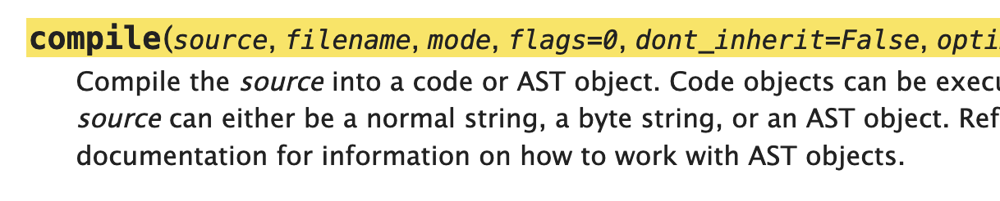
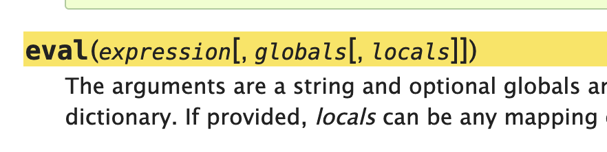

## Python has a macro language: it's Python

Tin Tvrtković <!-- .element: style="margin-top: 7rem" -->


I'm Tin  
(*teen*)


I do some open source

<ul>
<li>aiofiles
<li>pytest-asyncio
<li>cattrs
<li><em>attrs</em>
<li>quattro
<li>incant
<li>uapi
</ul><!-- .element: style="font-size: 70%; margin-top: 2rem" -->

Note:
Alright, so what are macros? How many of you have an idea of what a macro in any language is?


```C
#define PI   3.14159
```
```C
#ifndef _SPEAKUP_SERIAL_H
#define _SPEAKUP_SERIAL_H
```
```C
#include <linux/cgroup.h>
```

Note:
You've probably all seen something like this; this is the C preprocessor, one of the most common examples of macros.


```Rust
let mut vec1 = vec![1, 2, 3];
```
```
println!("hello world!");
```

Note:
Even modern languages like Rust have macros.
So a macro is kind of a language on top of the language, and a separate build step is used to execute the macro.
Python doesn't have that (yet). There are PEPs and people working on various versions of it, but nothing concrete yet.






Note:
What we do have are the compile and eval builtins.
This is necessary for interpreted languages, but isn't really common otherwise.
You wouldn't expect a Java program to have access to javac, or the Rust compiler to be available during runtime.
This is super cool, since we can feed it Python source code, as strings, and get classes and functions out!


! <!-- .element: class="r-fit-text" style="color: red" -->

Note:
I would be remiss if I didn't warn you about this being dangerous. Remove code execution, log4shell, etc.
This is an advance technique.
Alright, now that we know about codegen, let's talk about cattrs.


## cattrs


```python
from attrs import define
from cattrs import structure

@define
class MyClass:
    my_field: int

>>> structure({"my_field": 1}, MyClass)
MyClass(1)
```

Note:
cattrs 101: it's a companion library for attrs (but it works with dataclasses too).
You define your classes with attrs, and you structure them with cattrs.
cattrs slots in between your classes and your serialization libraries.
cattrs has a ton of other features (like tuples, unions, newtypes...) but this is the gist.


```python
def artisinal_structure(val):
    return MyClass(int(val["my_field"]))
```
```python
def cattrs_structure(self, val, cls):
    res = {}
    for attribute in fields(cls):
        handler = self.dispatch(attribute.type)
        res[attribute.name] = handler(val[attribute.name])
    return cls(**res)
```

Note:
At the start of 2019, cattrs 1.0 was done and I was thinking about how to get more people using cattrs, since I thought it was cool.
Instead of, you know, promoting it or building a community for it or building something useful on top of it, I thought it was too slow.
The first snippet is what you'd write manually, the second is what cattrs would execute for you.
The second obviously does more work, so it's slower.
So how do I get from the second snippet to the first?
If you can write the first one, I can make cattrs write it too!
So that's exactly what I did.


```python
def artisinal_structure(val):
    return MyClass(int(val["my_field"]))
```
```python
def structure_MyClass(
    o, 
    _, 
    *, 
    __cl=__cl,
    __c_structure_my_field=__c_structure_my_field
):
  return __cl(
    __c_structure_my_field(o["my_field"]),
  )
```

Note:
This is the exact function cattrs will put together and compile for you.
It's essentially identical to the artisinal version, except faster due to the locals trick.
So, a use case for codegen: performance. This is why cattrs (and libraries like Jinja) are so fast.


## attrs


```python
from attrs import define

@define
class MyClass:
    my_field: int

>>> MyClass(1)
MyClass(my_field=1)
```

Note:
attrs is a library for declaratively writing classes, written by Hynek Schlawack.
attrs generates a bunch of methods for your class; `__init__`, `__repr__`, `__eq__`.


```python
from inspect import getsource

>>> print(getsource(MyClass.__init__))
def __init__(self, my_field):
    self.my_field = my_field
```

Note:
First of all again performance.
Second, isn't it cool to be able to very easily see what your classes are actually doing?


```python
>>> print(getsource(MyClass.__eq__))
def __eq__(self, other):
    if other.__class__ is not self.__class__:
        return NotImplemented
    return  (
        self.my_field,
    ) == (
        other.my_field,
    )
```

Note:
Ever wonder what the attrs-generated `__eq__` looks like?
Third, you can use a debugger!


```python
from attrs import field
from attrs.validators import instance_of

@define
class MyValidatedClass:
    my_field: int = field(validator=instance_of(int))

>>> MyValidatedClass("not an int")
```
```
(Pdb) l
  1  	def __init__(self, my_field):
  2  	    _setattr = _cached_setattr.__get__(self, self.__class__)
  3  	    _setattr('my_field', my_field)
  4  	    if _config._run_validators is True:
  5  ->	        __attr_validator_my_field(self, __attr_my_field, self.my_field)
```
Note:
The init looks a little different since we're using a validator.
The second snippet shows that the code is available to the debugger!


## incant

Note:
incant is a very small library for function composition.
Since dependency injection is essentially function composition, incant can be called a DI library.


```python
from incant import Incanter
incanter = Incanter()

def my_function(a: int) -> int:
    return a

@incanter.register_by_type
def provides_int() -> int:
    return 5

>>> incanter.invoke(my_function)
5
```


```python
from incant import Incanter
incanter = Incanter()

def my_handler(user: User) -> int:
    return 5

@incanter.register_by_type
def provides_user() -> User:
    return 5

>>> incanter.invoke(my_function)
```


```python
def function_a() -> None:
    print("inside")
    return
```

Note:
Let's do two quick exercizes where we do a mock dialogue.
I'm implementing, say, a web framework, and you're a bunch of experienced Python devs.
There's this function, called function_a.
I want to wrap this function, to run some code before it runs and after.


```
def wrap_1(fn):
    def my_wrapper() -> None:
        print("before")
        try:
            return fn()
        finally:
            print("after")
    return my_wrapper

>>> wrap_1(function_a)()
before
inside
after
```

Note:
It's easy, Tin! You need to write a simple decorator.
Python has been able to do this for ages.
And you're right. It works.


```
def function_b(i: int) -> int:
    print("inside")
    return i

>>> wrap_1(function_b)(1)
Traceback (most recent call last):
  File "<stdin>", line 1, in <module>
TypeError: wrap_1.<locals>.my_wrapper() takes 0 positional arguments but 1 was given
```

Note:
What about this function? It takes an argument. Halp.


```python
def wrap_2(fn):
    def my_wrapper(*args, **kwargs) -> None:
        print("before")
        try:
            return fn(*args, **kwargs)
        finally:
            print("after")
    return my_wrapper

>>> wrap_2(function_b)(1)
before
inside
after
1
```

Note:
And you're all like, Tin my friend, easy in Python.
Change your decorator to accept args and kwargs, and pass them to the function.
And you're right, it works! Easy peasy.


```python
from inspect import signature

>>> signature(wrap_2(function_b))
<Signature (*args, **kwargs) -> None>

```
Note:
But, since I'm implementing a web framework, I need the function signature.
For dependency injection, OpenAPI schema generation, all that good stuff.


```python
from functools import wraps

def wrap_3(fn):
    @wraps(fn)
    def my_wrapper(*args, **kwargs) -> None:
        print("before")
        try:
            return fn(*args, **kwargs)
        finally:
            print("after")
    return my_wrapper

>>> signature(wrap_3(function_b))
<Signature (i: int) -> int>
```

Note:
Now you're all like, well here's the thing.
There's a decorator (so you can decorate while you decorate) in the functools module that can help you.
And you're right again, it works!


```python
def wrap_4(fn):
    @wraps(fn)
    def my_wrapper(x: int, *args, **kwargs) -> None:
        print(f"before, with {x}")
        try:
            return fn(*args, **kwargs)
        finally:
            print("after")
    return my_wrapper

>>> signature(wrap_4(function_b))
(i: int) -> int
```

Note:
So now for my final question: how do I keep all this functionality, and I add an argument just to the decorator?
So now my decorator is signature-changing.
Python doesn't have APIs for this so you have to reach for a custom solution.
One potential solution is, you guessed it, codegen.


```python
from incant import Incanter
incanter = Incanter()

@contextmanager
def wrap_5(x: int) -> None:
    print(f"before, with {x}")
    try:
        yield
    finally:
        print("after")

f = incanter.prepare(function_b, forced_deps=[(wrap_5, "sync")])
```

Note:
This is how you'd do it with incant.
After a little boilerplate, you'd define the wrapper as a context manager and prepare `function_b` with it as a forced dependency.


```python
def invoke_function_b(x: int, i: int) -> int:  
    with wrap_5(x):
        return _incant_inner_fn(i)

>>> signature(invoke_function_b)
(x: int, i: int) -> int
```

Note:
Incant will, essentially, generate this for you.
And, of course, this will work with `signature`.


## In Conclusion

Note:
Codegen is an advanced technique. 
It's definitely not something you should use every day for your business logic code, but it's something you might consider for infrastructure code.