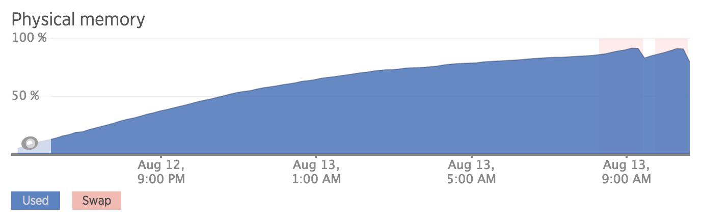
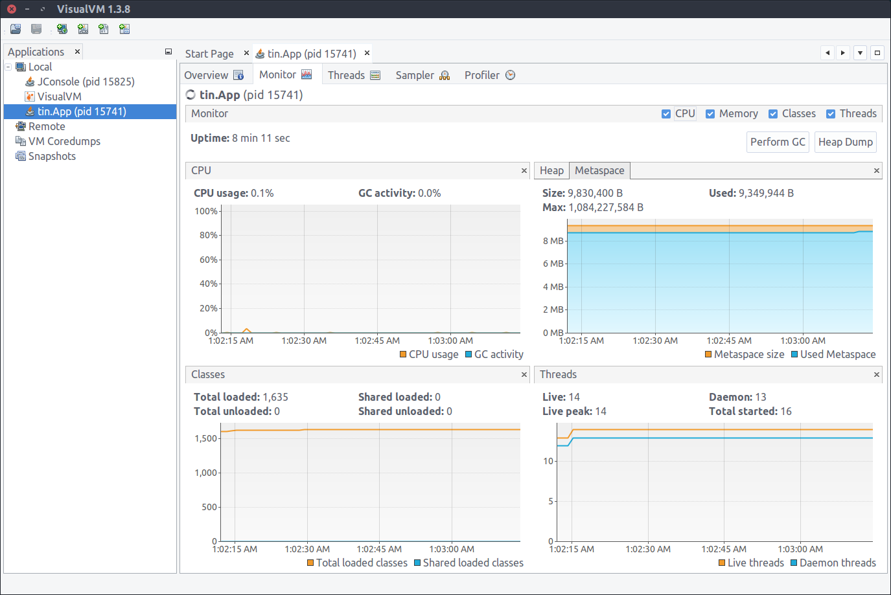

Debugging Running Python Applications
-------------------------------------

@tintvrtkovic

March 2016

* pytest-asyncio
* aiofiles
* fakeriak
* @SteamDB_Linux

<!-- .slide: data-background="#FFFFFF" -->
<!-- .element: style="border: 0;box-shadow: none;" -->

<!-- .slide: style="padding-top:0;" -->
<!-- .element: style="margin-top:0;" -->

<!-- .slide: style="padding-top:0;" -->
<!-- .element: style="margin-top:0;" -->

<!-- .slide: style="padding-top:0;" -->
<!-- .element: style="margin-top:0;" -->

<pre><code>
    class MainHandler(tornado.web.RequestHandler):
        def get(self):
            from meliae import scanner
            scanner.dump_all_objects('filename.json')

</code></pre>

<pre><code>
    class MyBestClass(object):
        ...
        def __del__(self):
            # Clean up.
            ...

</code></pre>

## PEP 0442
### Safe object finalization
(Python >= 3.4)

<!-- .slide: style="padding-top:0;" -->
<!-- .element: style="margin-top:0;" -->

<pre><code>
    $ kill -s SIGQUIT 11644
    
</code></pre>

<pre><code>
    "main" #1 prio=5 os_prio=0 tid=0x00007faa4000a800 nid=0x2d7d waiting on condition [0x00007faa4970d000]
       java.lang.Thread.State: TIMED_WAITING (sleeping)
    	at java.lang.Thread.sleep(Native Method)
    	at tin.App.main(App.java:11)
    
</code></pre>

## ``faulthandler``
(Python >= 3.3 or ``pip install faulthandler``)

<pre><code>
    python -x faulthandler ...
    
</code></pre>

or

<pre><code>
    PYTHONFAULTHANDLER=1 python ...
    
</code></pre>

or

<pre><code>
    import faulthandler
    faulthandler.enable()
    
</code></pre>

Only for:
* SIGSEGV
* SIGFPE
* SIGABRT
* SIGBUS
* SIGILL

<pre><code>
    import faulthandler, signal
    faulthandler.register(signal.SIGUSR1)
    
</code></pre>

Note:
<demo>
echo 0 | sudo tee /proc/sys/kernel/yama/ptrace_scope
sudo service apparmor teardown
pip install pyrasite
apt-get install gdb
for l in traceback.extract_stack(sys._current_frames()[140665193916224]): print(l)
faulthandler.dump_traceback(sys.__stdout__)
sys._current_frames()[140665193916224].f_locals['lock'].release()

<pre><code style="max-height: 600px;">
def inject(pid, filename, verbose=False, gdb_prefix=''):
    """Executes a file in a running Python process."""
    filename = os.path.abspath(filename)
    gdb_cmds = [
        'PyGILState_Ensure()',
        'PyRun_SimpleString("'
            'import sys; sys.path.insert(0, \\"%s\\"); '
            'sys.path.insert(0, \\"%s\\"); '
            'exec(open(\\"%s\\").read())")' %
                (os.path.dirname(filename),
                os.path.abspath(os.path.join(os.path.dirname(__file__), '..')),
                filename),
        'PyGILState_Release($1)',
        ]
    p = subprocess.Popen('%sgdb -p %d -batch %s' % (gdb_prefix, pid,
        ' '.join(["-eval-command='call %s'" % cmd for cmd in gdb_cmds])),
        shell=True, stdout=subprocess.PIPE, stderr=subprocess.PIPE)
    out, err = p.communicate()
    if verbose:
        print(out)
        print(err)

</code></pre>

<pre><code>
    $ .venv/bin/pyrasite -l
    Available payloads:
      dump_memory.py
      dump_modules.py
      dump_stacks.py
      force_garbage_collection.py
      reverse_python_shell.py
      reverse_shell.py
      start_callgraph.py
      stop_callgraph.py
      
</code></pre>

Note:
apt-get install gcc python3-dev
pip install cython
pip install meliae
pyrasite 1 dump_memory.py
pyrasite 1 dump_stacks.py

``tornadoredis/connection.py``
<pre><code>
    class Connection(object):
        ...
        def __del__(self):
            self.disconnect()
            
</code></pre>

<!-- .slide: style="padding-top:0;" -->
<!-- .element: style="margin-top:0;" -->

### Drawbacks

* Doesn't work with PyPy
* Doesn't work with uwsgi
* Doesn't work with gunicorn

<pre><code style="max-height: 600px;">
def inject(pid, filename, verbose=False, gdb_prefix=''):
    """Executes a file in a running Python process."""
    filename = os.path.abspath(filename)
    gdb_cmds = [
        'PyGILState_Ensure()',
        'PyRun_SimpleString("'
            'import sys; sys.path.insert(0, \\"%s\\"); '
            'sys.path.insert(0, \\"%s\\"); '
            'exec(open(\\"%s\\").read())")' %
                (os.path.dirname(filename),
                os.path.abspath(os.path.join(os.path.dirname(__file__), '..')),
                filename),
        'PyGILState_Release($1)',
        ]
    p = subprocess.Popen('%sgdb -p %d -batch %s' % (gdb_prefix, pid,
        ' '.join(["-eval-command='call %s'" % cmd for cmd in gdb_cmds])),
        shell=True, stdout=subprocess.PIPE, stderr=subprocess.PIPE)
    out, err = p.communicate()
    if verbose:
        print(out)
        print(err)

</code></pre>

<pre><code>
    $ gdb -p &lt;pid&gt;
    (gdb) info functions
    ...
    0x00000000009b96f0  _PyPy_NewReference
    0x00000000009b9bd0  PyPyGILState_Release
    0x00000000009b9c00  PyPyObject_Repr
    ...
    0x00000000009c3780  PyPy_UNICODE_ISDECIMAL
    0x00000000009c37d0  PyPyGILState_Ensure
    0x00000000009c3820  PyPyObject_AsFileDescriptor    
    ...
    0x00000000009f5c30  PyPyObject_GetAttrString
    0x00000000009f61e0  PyPyRun_SimpleString
    0x00000000009f6650  PyPyNumber_InPlaceRshift
    ...
    
</code></pre>

<pre><code style="max-height: 600px;">
def inject(pid, filename, verbose=False, gdb_prefix=''):
    """Executes a file in a running Python process."""
    filename = os.path.abspath(filename)
    gdb_cmds = [
        'PyPyGILState_Ensure()',
        'PyPyRun_SimpleString("'
            'import sys; sys.path.insert(0, \\"%s\\"); '
            'sys.path.insert(0, \\"%s\\"); '
            'exec(open(\\"%s\\").read())")' %
                (os.path.dirname(filename),
                os.path.abspath(os.path.join(os.path.dirname(__file__), '..')),
                filename),
        'PyPyGILState_Release($1)',
        ]
    p = subprocess.Popen('%sgdb -p %d -batch %s' % (gdb_prefix, pid,
        ' '.join(["-eval-command='call %s'" % cmd for cmd in gdb_cmds])),
        shell=True, stdout=subprocess.PIPE, stderr=subprocess.PIPE)
    out, err = p.communicate()
    if verbose:
        print(out)
        print(err)

</code></pre>
