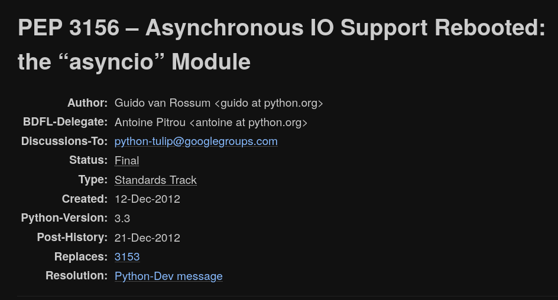
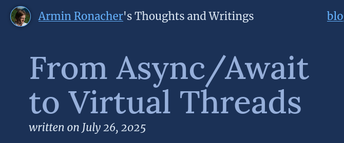
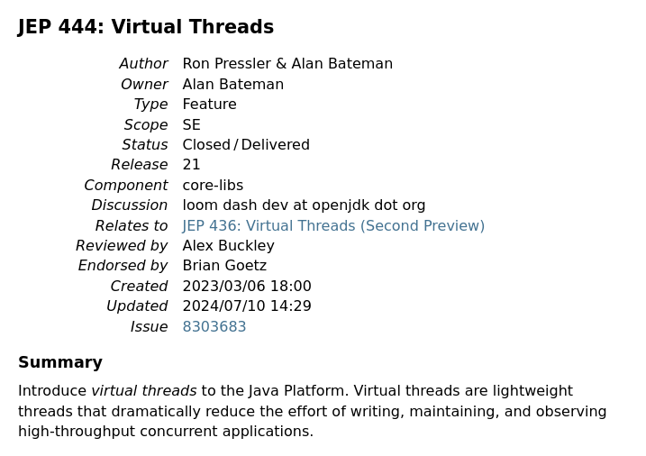

## Quo Vadis asyncio?

Tin Tvrtković <!-- .element: style="margin-top: 7rem" -->



Note:
Asyncio was added to Python via PEP 3156, 12 years ago.


Note:
I remember when Guido asked for feedback on the PEP.
After reading the PEP and providing some typo corrections, I got misattributed in the PEP repo!


Note:
I'm also the author of this little-known asyncio utility library.
It happened to contain a TaskGroup implementation before they were released in 3.11.
Also timeout context managers.


Note:
Python 3.14 was released last week. As you may know, one of the headliner features was free-threading.
Free threading means we finally get to have true parallelism in Python.
But what does this mean for asyncio exactly?
If you've ever written an asyncio application, I'm sure you've been told not to run CPU-intensive code on the asyncio main thread.


[https://docs.python.org/3/library/asyncio-dev.html#running-blocking-code](https://docs.python.org/3/library/asyncio-dev.html#running-blocking-code) <!-- .element: class="r-fit-text" -->
Note:
In fact, even the official docs state this.
So you might be thinking: since we have real parallelism now, I don't need to worry about this any more?


<div class="mermaid">
    <pre>
        %%{init: }%%
        flowchart TD
        A[Event Loop] --> T1[Thread 1]
        A --> T2[Thread 2]
        A --> T3[Thread 3]
    </pre>
</div>
Note:
You might be thinking, why can't the event loop distribute work over several threads now?
Maybe this is your mental model.
This is usually described as work-stealing, and even more broadly the M:N scheduling model.
But alas, no. This isn't possible now, and most likely won't be possible later.


# The asyncio invariant. <!-- .element: class="r-fit-text" -->
Note:
Becase of the asyncio invariant.
Even if you wrote a multi-threaded event loop, nothing in the ecosystem would actually work properly on it.
But this talk would be too short if that was all there was to it.


  <!-- .element: class="fragment" -->

[https://docs.python.org/3/library/asyncio-task.html#asyncio.to_thread](https://docs.python.org/3/library/asyncio-task.html#asyncio.to_thread) <!-- .element: class="r-fit-text" -->


<!-- .slide: data-auto-animate -->
<div class="mermaid">
    <pre>
        %%{init: }%%
        flowchart TD
        A[Event Loop] --> T1[Thread 1]
        A --> T2[Thread 2]
        A --> T3[Thread 3]
    </pre>
</div>


<!-- .slide: data-auto-animate data-auto-animate-duration="3" -->
<div class="mermaid">
    <pre>
        %%{init: }%%
        flowchart TD
        subgraph Single Process
        A[Event Loop 1] --> T1[Thread 1]
        B[Event Loop 2] --> T2[Thread 2]
        C[Event Loop 3] --> T3[Thread 3]
        end
    </pre>
</div>


<!-- .slide: data-auto-animate data-auto-animate-duration="3" -->
<div class="mermaid">
    <pre>
        %%{init: }%%
        flowchart TD
        subgraph Single Process
        A[Event Loop 1] --> T1[Thread 1]
        B[Event Loop 2] --> T2[Thread 2]
        C[Event Loop 3] --> T3[Thread 3]
        T1 --> W[Worker Threadpool]
        T2 --> W[Worker Threadpool]
        T3 --> W[Worker Threadpool]
        end
    </pre>
</div>
Notes:
These are the things we've received in 3.14 via free-threading.
Not revolutionary, but very very solid improvements to be had.


# Virtual Threads <!-- .element: class="r-fit-text" -->



[https://lucumr.pocoo.org/2025/7/26/virtual-threads/](https://lucumr.pocoo.org/2025/7/26/virtual-threads/) <!-- .element: class="r-fit-text" -->


[https://discuss.python.org/t/add-virtual-threads-to-python/91403](https://discuss.python.org/t/add-virtual-threads-to-python/91403) <!-- .element: class="r-fit-text" -->



Note:
This is a pretty well-written document, you should read it if you're into these kinds of things.
But what does Java have to do with Python?
Well, they're both fundamentally sync programming languages that also want to tap into async.


```java
    void main() {
        
        var thread = Thread.ofVirtual().start(() -> {
            System.out.println("Before");
            Thread.sleep(Duration.ofMillis(500L));
            System.out.println("After");
        });

    }
```
Note:
Ok, here's the money shot: this is what virtual threads look like.
See that `Thread.sleep()` in the middle there?
This is a good opportunity to introduce a new term: function coloring. 


[https://journal.stuffwithstuff.com/2015/02/01/what-color-is-your-function/](https://journal.stuffwithstuff.com/2015/02/01/what-color-is-your-function/) <!-- .element: class="r-fit-text" -->
Note:
There's this famous blog post.


Note:
Here's the simplest example of function coloring.
In practice it gets much worse: every library needs to be written twice.
Virtual threads sidestep this; the http client is written once, and the
application operator chooses whether to run it async or sync.


([https://www.gevent.org/](https://www.gevent.org/))
Note:
Some of you may have thought: Oh I've seen this, it's gevent.
Close, but not quite. Gevent monkeypatches the entire interpreter, virtual threads can run both sync and async code without problems.


<div class="mermaid">
    <pre>
        %%{init: }%%
        flowchart TD
        A[Event Loop] --> T1[Thread 1]
        A --> T2[Thread 2]
        A --> T3[Thread 3]
    </pre>
</div>
Note:
Remember this diagram from before, that asyncio wasn't able to do? Work-stealing, M:N scheduling?

Virtual threads can do this.
