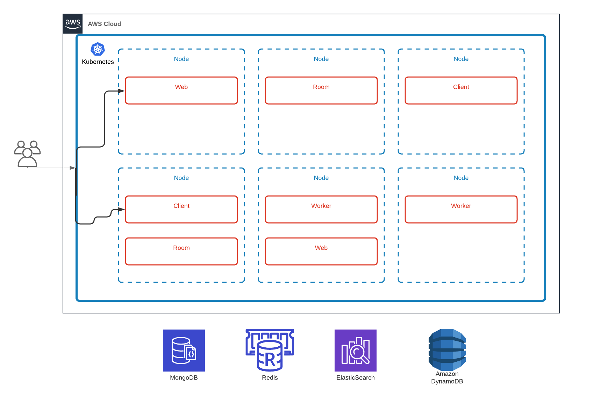
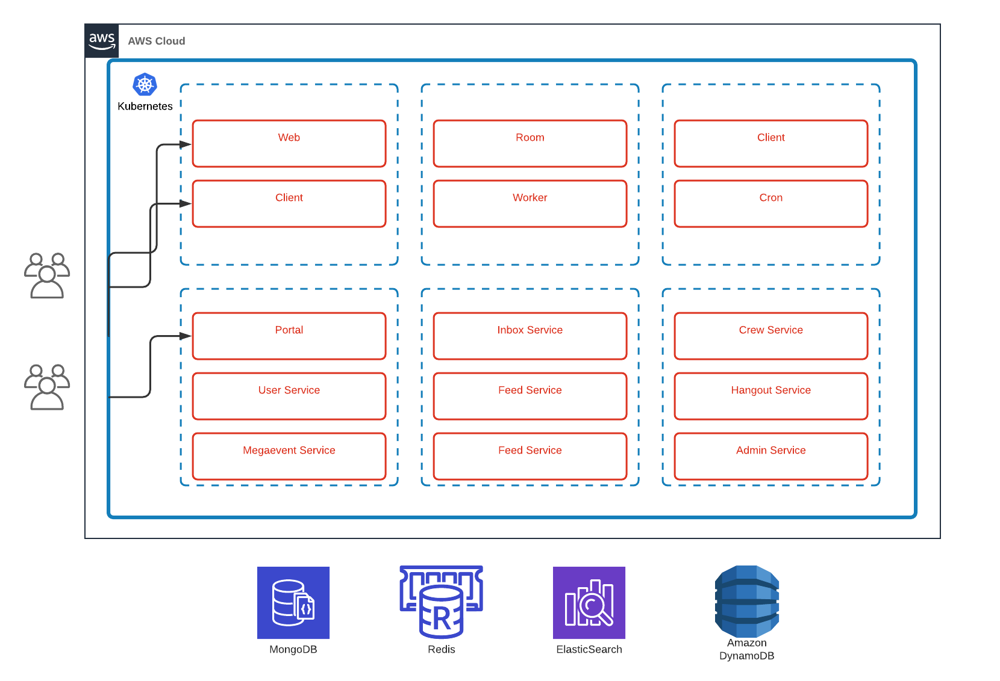

The Highrise Backend
----------

@tintvrtkovic<!-- .element: style="padding-top:200px;" -->

May 2020

<!-- .slide: data-background="#FFFFFF" -->
<!-- .element: style="border: 0;box-shadow: none;" -->

<!-- .element: style="border: 0;box-shadow: none;" -->

<!-- .element: style="border: 0;box-shadow: none; height: 650px;" -->

<!-- .element: style="border: 0;box-shadow: none; height: 650px;" -->

<!-- .element: style="border: 0;box-shadow: none; height: 650px;" -->

### HR1 Backend

* 23764 lines of JRuby
* 7668 lines of Scala
* 5821 lines of ERB

<!-- .element: style="border: 0;box-shadow: none; height: 650px;" -->

* Containerized, running in Kubernetes (but an ancient version)
* Extremely memory hungry (400 GB for 1k concurrent)
* The pods leak memory and are periodically restarted
* Relatively CPU efficient

* CI pipeline using Shippable
* Difficult to run locally
* No unit tests
* Deploys take over 30 minutes
* *Everything* gets redeployed

* The client and room pods are clustered together using Akka
* Room state is kept in-memory in the room pods

* Rollbar for error logging
* Very limited non-error logs

* Prometheus (integrated with Kubernetes) for metrics

### HR2 Backend Plan

* Write it in async Python
* Use Flatbuffers to communicate with the client
* Ensure scalability

# Microservices
* portal (Go)
* user, inbox, feed, crew, hangout, admin, shop, megaevent (Python)
* HTTP used for almost all inter-service communication

<!-- .element: style="border: 0;box-shadow: none; height: 650px;" -->

# The Anatomy of a Microservice
* only one kind of deployment
* HTTP endpoints for the client (Flatbuffer) and other services (msgpack)
* Arq used for background tasks and cron
* aiojobs for short, in-process jobs

* Containerized, Kubernetes-ready
* CI pipeline using GitHub Actions
* Using Poetry as the build system
* Automated linting with Black, isort and flake8
* Can be run locally with ease, using code reload (watchgod)
* Deploys take under 3 minutes
* Can be deployed piecemeal, with no downtime
Note:
Makefiles

* Structured logging (using structlog), sent to ElasticSearch
* Everything is logged (not only errors)
* Integrated yappi for async profiling

* Flatbuffers are hard to use and slow
* Solution: flattrs (https://github.com/Tinche/flattrs)
* Also, we basically wrote a Mongo async ORM
* Wish for a better code sharing system
Note:
flattrs is attrs for Flatbuffers. Declarative classes, Cython speed.

* Vast majority of code type annotated
* Working on integrating Mypy (~next 3 months)
* Writing an RPC library suitable for use with Mypy (Pyrseia)
Note:
Data structures are type annotated for de/serialization
Code is type annotated for documentation

* HR1 is RAM hungry, HR2 is CPU hungry
* Still using a large chunk of HR1 code (because of interop)
* Maintaining two stacks is very difficult
Note:
Makes EC2 instance reservations difficult - HR1 wants r instances, HR2 wants C instances
Interop - rooms, inbox and feed are shared, so some of these share code paths
Two stacks, four languages - makes database upgrades interesting

### The Roadmap

* Phase out all HR1 code (rooms and AP)
* Rebuild the K8s cluster
* Rebuild our EC2 fleet
