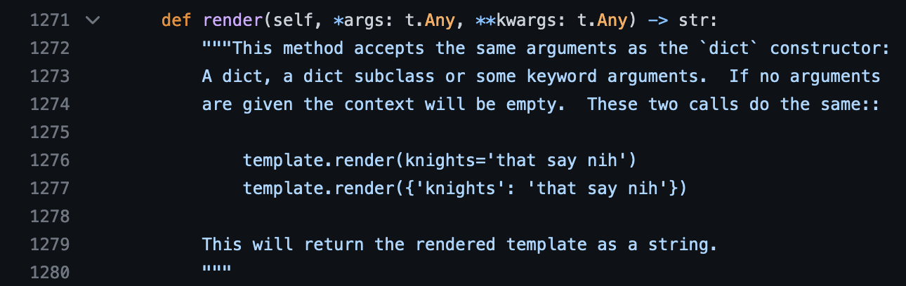
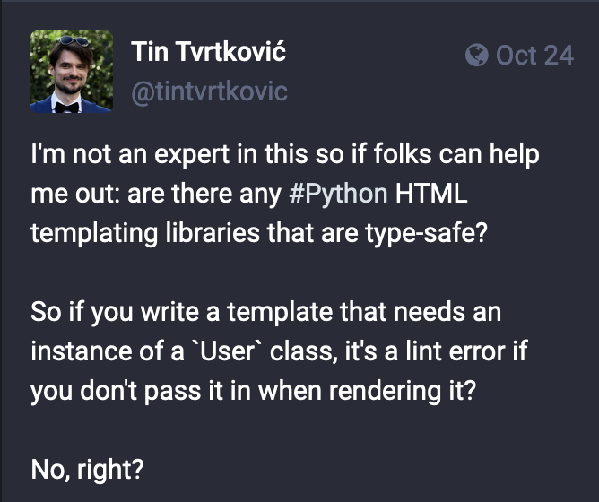
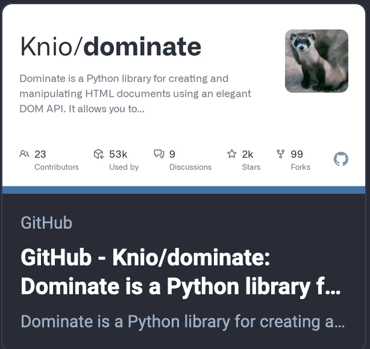

## The why, when and how of static typing in Python

Tin Tvrtković <!-- .element: style="margin-top: 7rem" -->


I own 3 "critical" projects on PyPI, <br>
and maintain one more:

<ul>
<li>cattrs
<li>pytest-asyncio
<li>aiofiles
<li><em>attrs</em>
</ul><!-- .element: style="font-size: 70%; margin-top: 2rem" -->


I'm involved with the typing community

<ul>
<li class="fragment fade-in-then-semi-out" data-fragment-index="1">I work on the <em>attrs</em> mypy plugin
<li class="fragment fade-in-then-semi-out" data-fragment-index="2"><a href="drive.google.com/file/d/1QimG7XlHLHImabjiywPUoqe92NTuIwV0/view?pli=1">typing-sig talk on attrs</a>
<li class="fragment fade-in-then-semi-out" data-fragment-index="3"><a href="https://github.com/pallets/click/pull/2562">click typing infrastructure</a>
</ul><!-- .element: style="font-size: 70%; margin-top: 2rem" -->

Note:
Core devs routinely ask me typing questions.


I use typing a lot

<ul>
<li class="fragment fade-in-then-semi-out" data-fragment-index="1">principal engineer in gaming for ~5.5 years
<li class="fragment fade-in-then-semi-out" data-fragment-index="2">Python backend with over <strong>700 endpoints, jobs, events</strong>
<li class="fragment fade-in-then-semi-out" data-fragment-index="2">team size of 1-8, ended up with <strong>3</strong>
</ul><!-- .element: style="font-size: 70%; margin-top: 2rem" -->

Note:
This wouldn't be possible without typing.


Static typing has been here for a while.

<ul>
<li class="fragment fade-in-then-semi-out" data-fragment-index="1"><a href="https://peps.python.org/pep-3107/">PEP 3107 - Function Annotations</a> was created in 2006
<li class="fragment fade-in-then-semi-out" data-fragment-index="2">Mypy 0.1.0 was released in 2014
<li class="fragment fade-in-then-semi-out" data-fragment-index="3"><a href="https://peps.python.org/pep-0484/">PEP 484 - Type Hints</a> was created in 2014
</ul><!-- .element: style="font-size: 70%; margin-top: 2rem" -->

Note:


The type system was a *retrofit*.

Note:
This is important for two reasons: complexity (enums vs literals) and ecosystem.


Static typing marches forward

<ul>
<li class="fragment fade-in-then-semi-out" data-fragment-index="1">Python 3.8: <a href="https://peps.python.org/pep-0589/">TypedDicts</a>, <a href="https://peps.python.org/pep-0586/">Literals</a>, <a href="https://peps.python.org/pep-0591/">Final</>, <a href="https://peps.python.org/pep-0544/">Protocols</a>
<li class="fragment fade-in-then-semi-out" data-fragment-index="2">Python 3.9: <a href="https://peps.python.org/pep-0585/">list[T] instead of typing.List[T]</a>, <a href="https://peps.python.org/pep-0593/">typing.Annotated</a>
<li class="fragment fade-in-then-semi-out" data-fragment-index="3">Python 3.10: <a href="https://peps.python.org/pep-0604/">A | B instead of typing.Union[A, B]</a>
<li class="fragment fade-in-then-semi-out" data-fragment-index="4">Python 3.12: <a href="https://peps.python.org/pep-0695/">Generics without TypeVars</a>
</ul><!-- .element: style="font-size: 70%; margin-top: 2rem" -->


Typecheckers

<ul>
<li class="fragment fade-in-then-semi-out" data-fragment-index="1">Mypy
<li class="fragment fade-in-then-semi-out" data-fragment-index="2">Pyright
<li class="fragment fade-in-then-semi-out" data-fragment-index="3">Pyre
</ul><!-- .element: style="font-size: 70%; margin-top: 2rem" -->


<!-- .slide: data-auto-animate -->
# Why?


<!-- .slide: data-auto-animate -->
# Why?

<ul>
<li>Confidence
</ul><!-- .element: style="font-size: 70%; margin-top: 2rem" -->

Note:
Mention velocity for confidence


<!-- .slide: data-auto-animate -->
<ul>
<li>Confidence
</ul><!-- .element: style="font-size: 70%" -->

## Can typing replace testing?<!-- .element: style="margin-top: 10rem" -->


<!-- .slide: data-auto-animate -->
<ul>
<li>Confidence
</ul><!-- .element: style="font-size: 70%" -->

## Can typing replace testing?<!-- .element: style="margin-top: 10rem" -->

# Yes.


<!-- .slide: data-auto-animate -->
<ul>
<li>Confidence
</ul><!-- .element: style="font-size: 70%" -->

## Can typing replace testing?<!-- .element: style="margin-top: 10rem" -->

Tests take a looong time to write.<!-- .element: style="margin-top: 5rem" -->

Tests need to be maintained.


<!-- .slide: data-auto-animate -->
<ul>
<li>Confidence
</ul><!-- .element: style="font-size: 70%" -->

## Can typing replace testing?<!-- .element: style="margin-top: 6rem" -->

Highrise had:<!-- .element: style="margin-top: 4rem" -->

<ul>
<li>Very tight typing <!-- .element: class="fragment fade-in-then-semi-out" data-fragment-index="1" -->
<li>A QA team <!-- .element: class="fragment fade-in-then-semi-out" data-fragment-index="2" -->
<li>E2E tests <!-- .element: class="fragment fade-in-then-semi-out" data-fragment-index="3" -->
<li>Amazing observability <!-- .element: class="fragment fade-in-then-semi-out" data-fragment-index="4" -->
<li>A tolerance for bugs <!-- .element: class="fragment fade-in-then-semi-out" data-fragment-index="5" -->
<li>Clawbacks <!-- .element: class="fragment fade-in-then-semi-out" data-fragment-index="6" -->
<li>0 unit tests <!-- .element: class="fragment fade-in-then-semi-out" data-fragment-index="7" -->
</ul><!-- .element: style="font-size: 70%; margin-top: 2rem" -->


<!-- .slide: data-auto-animate -->
# Why?

<ul>
<li>Confidence
<li>Refactoring <!-- .element: class="fragment fade-in-then-semi-out" data-fragment-index="2" -->
<li>Documentation <!-- .element: class="fragment fade-in-then-semi-out" data-fragment-index="3" -->
<li>Runtime validation <!-- .element: class="fragment fade-in-then-semi-out" data-fragment-index="4" -->
<li>Performance <!-- .element: class="fragment fade-in-then-semi-out" data-fragment-index="5" -->
</ul><!-- .element: style="font-size: 70%; margin-top: 2rem" -->


<!-- .slide: data-auto-animate -->
# When not to?


<!-- .slide: data-auto-animate -->
# When not to?

<ul>
<li>Metaprogramming
<li>Framework support and API design<!-- .element: class="fragment fade-in-then-semi-out" data-fragment-index="1" -->
</ul><!-- .element: style="font-size: 70%; margin-top: 8rem" -->


<!-- .slide: data-auto-animate -->
<ul>
<li>Framework support and API design
</ul><!-- .element: style="font-size: 70%; margin-bottom: 8rem" -->

Let's look at templating libraries: Jinja2.


<!-- .slide: data-auto-animate -->
<ul>
<li>Framework support and API design
</ul><!-- .element: style="font-size: 70%; margin-top: 0rem" -->




<!-- .slide: data-auto-animate -->
<ul>
<li>Framework support and API design
</ul><!-- .element: style="font-size: 70%; margin-top: 0rem" -->

A quick aside: type hints don't make code _type-safe_.
<!-- .element: style="margin-top: 19rem" -->


<!-- .slide: data-auto-animate -->
<ul>
<li>Framework support and API design
</ul><!-- .element: style="font-size: 70%; margin-top: 0rem" -->




<!-- .slide: data-auto-animate -->
<ul>
<li>Framework support and API design
</ul><!-- .element: style="font-size: 70%; margin-top: 0rem" -->




<!-- .slide: data-auto-animate -->
<ul>
<li>Framework support and API design
</ul><!-- .element: style="font-size: 70%; margin-bottom: 8rem" -->

Let's look at Django. 
<p class="fragment fade-in-then-semi-out" data-fragment-index="1">(With django-stubs.)</p>


<!-- .slide: data-auto-animate -->
<ul>
<li>Framework support and API design
</ul><!-- .element: style="font-size: 70%; margin-bottom: 8rem" -->

```python
from django.db import models

class Person(models.Model):
    first_name = models.CharField(max_length=30)
    last_name = models.CharField(max_length=30)
```


<!-- .slide: data-auto-animate -->
<ul>
<li>Framework support and API design
</ul><!-- .element: style="font-size: 70%; margin-bottom: 8rem" -->

```python
reveal_type(Person.__init__)
# def (
#     self: django.db.models.base.Model, 
#     *args: Any, 
#     **kwargs: Any
# )
```


<!-- .slide: data-auto-animate -->
<ul>
<li>Framework support and API design
</ul><!-- .element: style="font-size: 70%; margin-bottom: 8rem" -->

```python
reveal_type(reveal_type(Person._default_manager.get))
# def (*args: Any, **kwargs: Any) -> testdjango.models.Person"
```


<!-- .slide: data-auto-animate -->
<ul>
<li>Framework support and API design
</ul><!-- .element: style="font-size: 70%; margin-bottom: 8rem" -->

<ul>
<li>Input data ✅  (django.http.HttpRequest)
<li>Business logic ❌  (the ORM)
<li>Output HTML ❌  (template rendering)
</ul><!-- .element: style="font-size: 70%; margin-top: 0rem" -->


<!-- .slide: data-auto-animate -->
# When not to?

<ul>
<li>Metaprogramming<!-- .element: style="opacity: 0.5" -->
<li>Framework support and API design<!-- .element: style="opacity: 0.5" -->
<li>Throwaway code, tests
</ul><!-- .element: style="font-size: 70%; margin-top: 8rem" -->


<!-- .slide: data-auto-animate -->
# How?


<!-- .slide: data-auto-animate -->
# How?

Gradual typing sucks.<!-- .element: style="margin-top: 8rem" -->


<!-- .slide: data-auto-animate -->
# How?

Separate typed and untyped code.<!-- .element: style="margin-top: 8rem" -->


<!-- .slide: data-auto-animate -->
# How?

Separate typed and untyped code.<!-- .element: style="margin-top: 8rem" -->

Make a typed facade for untyped code.


<!-- .slide: data-auto-animate -->
# How?

Write in-house stubs.<!-- .element: style="margin-top: 8rem" -->


<!-- .slide: data-auto-animate -->
Write in-house stubs.

```python
class Redis(Generic[TPool]):
    
    async def set(
        self,
        key: str,
        value: str | bytes | int,
        *,
        expire: int | None = ...,
        pexpire: int | None = ...,
        exist: ExistenceConditional | None = ...,
    ) -> bool: ...
    
```
<!-- .element: style="margin-top: 5rem" -->


<!-- .slide: data-auto-animate -->
# How?

Write in-house stubs.<!-- .element: style="margin-top: 8rem" -->


<!-- .slide: data-auto-animate -->
# How?

Write in-house typed layers.<!-- .element: style="margin-top: 8rem" -->

https://uapi.threeofwands.com/<!-- .element: class="fragment fade-in" data-fragment-index="1" -->